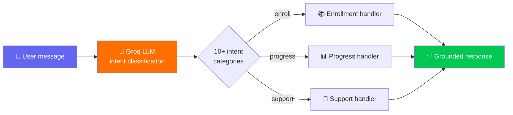
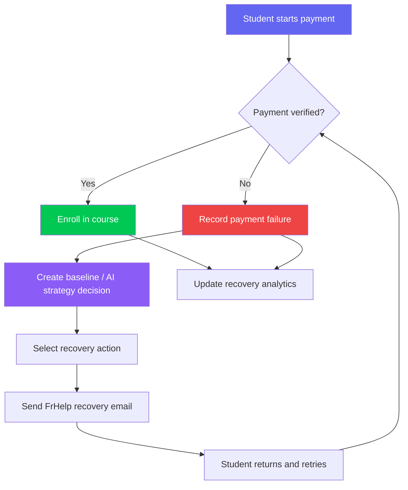

<!-- ══════════════════════ BANNER ══════════════════════ -->
<div align="center">


<!-- Typing animation -->
<a href="https://frhelp-frontend.vercel.app/">

</a>

<br/><br/>

<!-- Primary CTA badges -->
<a href="https://frhelp-frontend.vercel.app/"></a>
&nbsp;
<a href="https://github.com/Kartiksahu03/Frhelp-Hosting"></a>
&nbsp;
<a href="https://kartik-s-portfolio-tau.vercel.app"></a>

<br/><br/>

<!-- Tech pills -->


</div>

<br/>

> [!NOTE]
> The backend runs on Render's free tier and sleeps after inactivity — **first load may take ~30–50 seconds** to wake up. Give it a moment. ☕

<!-- ══════════════════════ DIVIDER ══════════════════════ -->


## 🎯 What is FrHelp?

**FrHelp** is a production-grade EdTech platform where students enroll in courses, instructors publish them, and admins run the show — with a **Groq-powered AI assistant** and an **AI-driven payment recovery experiment system**. The platform is JWT-secured, payment-integrated, email-enabled, and records real payment failure and recovery outcomes for analysis.

<br/>

<!-- ══════════════════════ FEATURES ══════════════════════ -->
<div align="center">

## ✨ Features

</div>

<table>
<tr>
<td width="50%" valign="top">

### 🔐 Auth & Access
- **JWT authentication** across **15+ protected routes**
- **Role-Based Access Control** — 3 distinct roles
- Server-side enforcement (not just hidden UI)

</td>
<td width="50%" valign="top">

### 👥 Three Roles, Three Experiences
- 🎓 **Student** — browse, enroll, track progress
- 🧑‍🏫 **Instructor** — create & manage courses
- 🛡️ **Admin** — full platform control

</td>
</tr>
<tr>
<td width="50%" valign="top">

### 📚 Courses & Payments
- **100+ courses** with enrollment & progress tracking
- **Razorpay** — order creation → verification → auto-enrollment
- Payment failures and successful retries recorded as recovery outcomes
- Instructor-side course creation flow

</td>
<td width="50%" valign="top">

### 🤖 AI Assistant
- Built on **Groq GPT-OSS-20B**
- Classifies user intent and supports course-related queries
- Cuts down manual support load

</td>
</tr>
</table>

### 💳 AI Payment Recovery
- Records real payment failures from the integrated payment flow
- Compares **Baseline** and **AI Strategy** recovery decisions
- Tracks failed payments, recovery attempts, successful recoveries, recovery rate, and recovered revenue
- Sends branded **FrHelp payment recovery emails** with a direct return link
- Shows a decision log containing scenario, error code, reason, strategy, and action
- Updates enrollment only after verified successful payment

<!-- ══════════════════════ DIVIDER ══════════════════════ -->


<!-- ══════════════════════ TECH STACK ══════════════════════ -->
<div align="center">

## 🛠️ Tech Stack


<br/><br/>

| Layer | Technologies |
|:---:|:---|
| **Frontend** | React.js · Redux Toolkit · Tailwind CSS · Axios |
| **Backend** | Node.js · Express.js · MongoDB (Mongoose) · JWT |
| **Payments** | Razorpay · payment verification · recovery analytics |
| **Email** | Resend API · payment recovery and transaction emails |
| **AI** | Groq API (GPT-OSS-20B) — intent classification |
| **Storage** | Cloudinary |
| **Deploy** | Vercel · Render · MongoDB Atlas |

</div>

<!-- ══════════════════════ DIVIDER ══════════════════════ -->


## 🏗️ Architecture

```
frhelp/
├── 🎨 client/                 # React frontend
│   └── src/
│       ├── app/              # Redux store
│       ├── features/         # auth · courses · enrollment · payment recovery · ai
│       ├── components/       # layout · course-cards · dashboard · ai-chat
│       ├── pages/            # Student · Instructor · Admin dashboards · Recovery Analytics
│       └── services/         # axios instance + API integrations
│
└── ⚙️ server/                 # Express + MongoDB API
    ├── models/              # User · Course · Enrollment · Payment · Recovery records
    ├── controllers/         # auth · course · enrollment · payment · recovery · ai
    ├── routes/              # one router per domain, role-gated
    ├── middlewares/         # JWT protect · role-check · error handler
    └── services/            # Razorpay · Groq · Resend · recovery logic
```

> Role checks live in a dedicated middleware layer *after* JWT verification — each route declares which roles may access it, instead of scattering permission logic through controllers.

<!-- ══════════════════════ AI FLOW ══════════════════════ -->
## 🧠 How the AI Assistant Works



<!-- ══════════════════════ PAYMENT RECOVERY FLOW ══════════════════════ -->
## 💳 AI Payment Recovery Flow



### Recovery Analytics

The student-facing recovery dashboard reports:

- Failed Payments
- Recovery Attempts
- Successful Recoveries
- Recovery Rate
- Recovered Amount
- Incremental Recovered Revenue
- Decision Log for each recorded experiment

The metrics are calculated from recorded payment and recovery outcomes rather than static dashboard values.

<!-- ══════════════════════ QUICKSTART ══════════════════════ -->


## 🚀 Quick Start

<details>
<summary><b>📦 Click to expand setup instructions</b></summary>

<br/>

**Prerequisites:** Node.js 18+ · [MongoDB Atlas](https://www.mongodb.com/atlas) · [Razorpay test keys](https://razorpay.com/) · [Groq API key](https://console.groq.com/keys)

```bash
# 1. Clone
git clone https://github.com/Kartiksahu03/Frhelp-Hosting.git
cd Frhelp-Hosting

# 2. Backend
cd server
npm install
cp .env.example .env      # fill in values below
npm run dev
```

`server/.env`:
```env
PORT=4000
MONGO_URI=your_mongodb_atlas_uri
JWT_SECRET=any_long_random_string
JWT_EXPIRES_IN=7d
RAZORPAY_KEY_ID=your_razorpay_key_id
RAZORPAY_KEY_SECRET=your_razorpay_key_secret
GROQ_API_KEY=your_groq_key
FRONTEND_URL=http://localhost:3000
RESEND_API_KEY=your_resend_api_key
MAIL_FROM=FrHelp <onboarding@resend.dev>
```

```bash
# 3. Frontend (new terminal)
cd client
npm install
cp .env.example .env      # REACT_APP_BASE_URL=http://localhost:4000/api/v1
npm run dev
```

Open `http://localhost:3000` and sign up. 🎉

</details>

<!-- ══════════════════════ ROADMAP ══════════════════════ -->
## 🗺️ Roadmap

- [ ] 🧪 Automated test suite (Jest + Supertest)
- [ ] 🐳 Docker + docker-compose for one-command setup
- [ ] 📈 Instructor-side analytics dashboard
- [ ] 📧 Email notifications for enrollment/payment

<!-- ══════════════════════ FOOTER ══════════════════════ -->


<div align="center">

## 👤 Built by Kartik Sahu

Full-Stack Developer · MERN + AI Integration

<a href="https://kartik-s-portfolio-tau.vercel.app"></a>
<a href="https://github.com/Kartiksahu03"></a>
<a href="https://linkedin.com/in/kartik-sahu03"></a>
<a href="mailto:kartik.sahu3311@gmail.com"></a>

<br/><br/>


</div>
